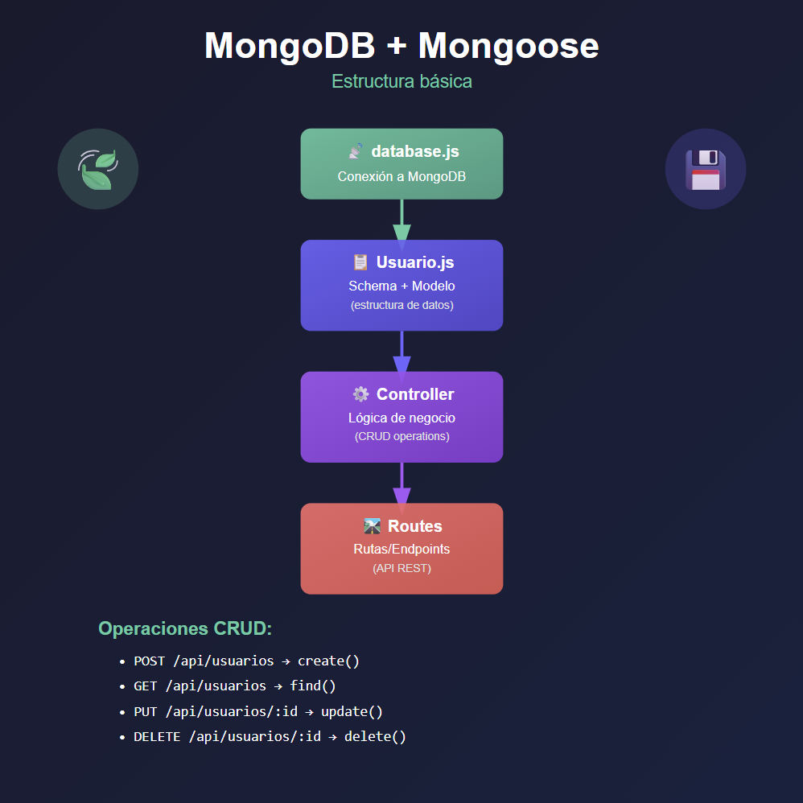
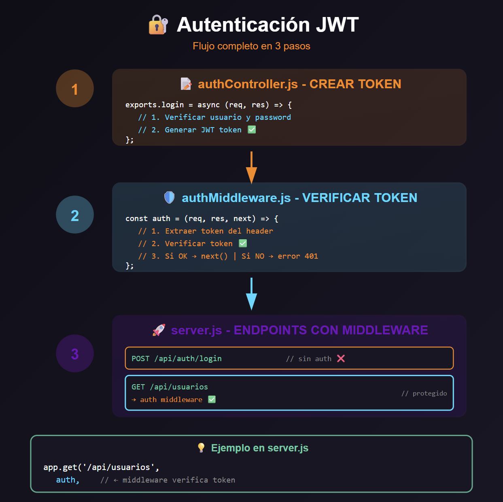
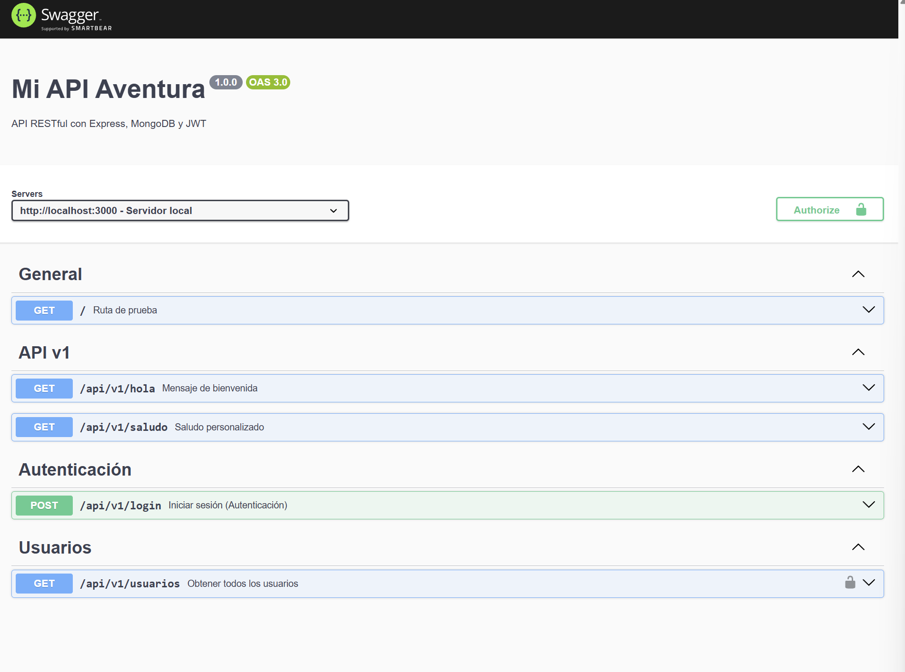

Para iniciar el proyecto, en lugar de hacer "npm init -y" (que crea un package.json con valores por defecto), inicializo el proyecto con "npm init" para poder personalizar los valores del package.json, como el nombre del proyecto, la versión, la descripción, el punto de entrada, el repositorio git, las palabras clave, el autor y la licencia. Esto me permite tener un control más detallado sobre la configuración inicial del proyecto desde el principio.

En el package.json he cambiado el valor del campo "main" de "index.js" a "server.js" para que el punto de entrada del proyecto sea el archivo server.js en lugar de index.js. Además, he añadido un script "start" que permite iniciar la aplicación con el comando "npm start", ejecutando "node server.js".

He instalado Express para poder crear el servidor y manejar las rutas de la API.
El comando usado ha sido: npm install express

He creado el archivo server.js en la raíz del proyecto para crear el servidor que escucha en el puerto 3000.

## Estructura básica de un servidor Express


## Integración de MongoDB con Mongoose

### ¿Qué es Mongoose?

Facilita el trabajo con MongoDB proporcionando:

- Validación de datos
- Esquemas (schemas) para estructurar documentos
- Métodos para realizar operaciones CRUD
- Middleware y hooks
- Conversión automática de tipos

Instalamos con :
npm install mongoose

### Estructura de archivos con Mongoose



#### **Schema (Esquema)**

Define la **estructura** de tus datos: campos, tipos de datos y validaciones.

**Ubicación:** `modelo/Usuario.js`

El schema especifica:

- Qué campos tiene cada documento (nombre, email, edad, etc.)
- Tipo de dato de cada campo (String, Number, Boolean, etc.)
- Validaciones (required, unique, min, max, etc.)
- Valores por defecto

#### **Modelo**

Es la **representación del schema** como clase para interactuar con la base de datos.

**Ubicación:** `modelo/Usuario.js` (mismo archivo que el schema)

El modelo te permite:

- Crear nuevos documentos
- Buscar documentos (find, findOne, findById)
- Actualizar documentos
- Eliminar documentos

#### **Controlador (Lógica de negocio)**

Contiene las **funciones con la lógica** para realizar operaciones CRUD.

**Ubicación:** `api/v1/usuarios.js`

Aquí se implementan las operaciones CRUD

#### **Rutas (Endpoints)**

Define los **endpoints de la API** y los conecta con los controladores.

**Ubicación:** `server.js`

Las rutas mapean las peticiones HTTP a las funciones del controlador.

#### **Conexión a MongoDB**

Establece la **conexión con la base de datos** MongoDB Atlas.

**Ubicación:** `config/db.js`

Configura y ejecuta la conexión

---

## Autenticación con JWT (JSON Web Tokens)



### Pasos para implementar autenticación JWT

#### 1. **Crear el token en `login.js`**

**Ubicación:** `api/v1/login.js`

- Verificar credenciales (usuario y contraseña)
- Si son correctas: generar token JWT con `jwt.sign()`
- Devolver el token al cliente

#### 2. **Crear middleware de verificación `auth.js`**

**Ubicación:** `middleware/auth.js`

- Recibir token del header `Authorization`
- Verificar validez del token con `jwt.verify()`
- Si es válido: permitir acceso con `next()`
- Si no: bloquear con error 401/403

#### 3. **Definir endpoints y llamar al middleware en `server.js`**

**Ubicación:** `server.js`

- Endpoint `POST /api/v1/login` → usa `login()` para generar token
- Endpoint `GET /api/v1/usuarios` → usa `verificarToken` como middleware para proteger la ruta

**Sintaxis:**

```javascript
app.get("/api/v1/usuarios", verificarToken, async (req, res) => {
  // Solo se ejecuta si verificarToken() permite el acceso
});
```

---

## Documentación de API con Swagger

Documentar una API significa explicar claramente cómo funciona para que cualquier desarrollador pueda usarla sin necesidad de leer tu código ni preguntarte nada.
Esto la hace más legible y facilita la colaboración entre desarrolladores.
La documentación de una api debe incluir los endpoints disponibles, los parámetros que aceptan, los formatos de request y response, los códigos de estado HTTP, y ejemplos de uso.

### ¿Qué es Swagger?

**Swagger** (ahora parte de OpenAPI) es una herramienta para **documentar APIs de forma interactiva**.Muestra en una página web la documentación de tu API.

### Implementación en el proyecto



#### **1. Instalar dependencias**

```bash
npm install swagger-ui-express swagger-jsdoc
```

#### **2. Crear configuración de Swagger**(creamos archivo swagger.js)

**Ubicación:** `config/swagger.js`

Define la información básica de tu API:

````javascript
import swaggerJsdoc from "swagger-jsdoc";

const options = {
  definition: {
    openapi: "3.0.0",
    info: {
      title: "Mi API Aventura",
      version: "1.0.0",
      description: "API RESTful con Express, MongoDB y JWT",
      contact: {
        name: "Proyecto de práctica - Módulo 7",
      },
    },
    servers: [
      {
        url: "http://localhost:3000",
        description: "Servidor local",
      },
      {
        url: "https://mi-api-aventura-sigma.vercel.app",
        description: "Servidor en Vercel",
      },
    ],
    components: {
      securitySchemes: {
        bearerAuth: {
          type: "http",
          scheme: "bearer",
          bearerFormat: "JWT",
          description:
            "Ingresa el token JWT obtenido del endpoint /api/v1/login",
        },
      },
    },
  },
  apis: ["./server.js"], // Archivos donde están los comentarios de documentación
};

export default swaggerJsdoc(options);

- Título, versión, descripción
- Servidores (localhost, producción)
- Esquemas de autenticación (JWT)

#### **3. Documentar endpoints con JSDoc**

**Ubicación:** `server.js`

Añadir comentarios especiales antes de cada endpoint:

```javascript
/**
 * @swagger
 * /api/v1/saludo:
 *   get:
 *     summary: Saludo personalizado
 *     parameters:
 *       - in: query
 *         name: nombre
 *         required: true
 *     responses:
 *       200:
 *         description: Saludo exitoso
 */
app.get("/api/v1/saludo", (req, res) => {
  // ...
});
````

#### **4. Servir Swagger UI**

**Ubicación:** `server.js`

```javascript
import swaggerUi from "swagger-ui-express";
import swaggerSpec from "./config/swagger.js";

app.use("/api-docs", swaggerUi.serve, swaggerUi.setup(swaggerSpec));
```

### Acceder a la documentación

**Desarrollo:** `http://localhost:3000/api-docs`

**Resumen rápido: ¿cómo se usa Swagger?**

-Instalas los paquetes

-Configuras Swagger en tu servidor

-Escribes comentarios encima de tus endpoints

-Swagger convierte esos comentarios en documentación interactiva

-Vas a /api-docs y la ves
