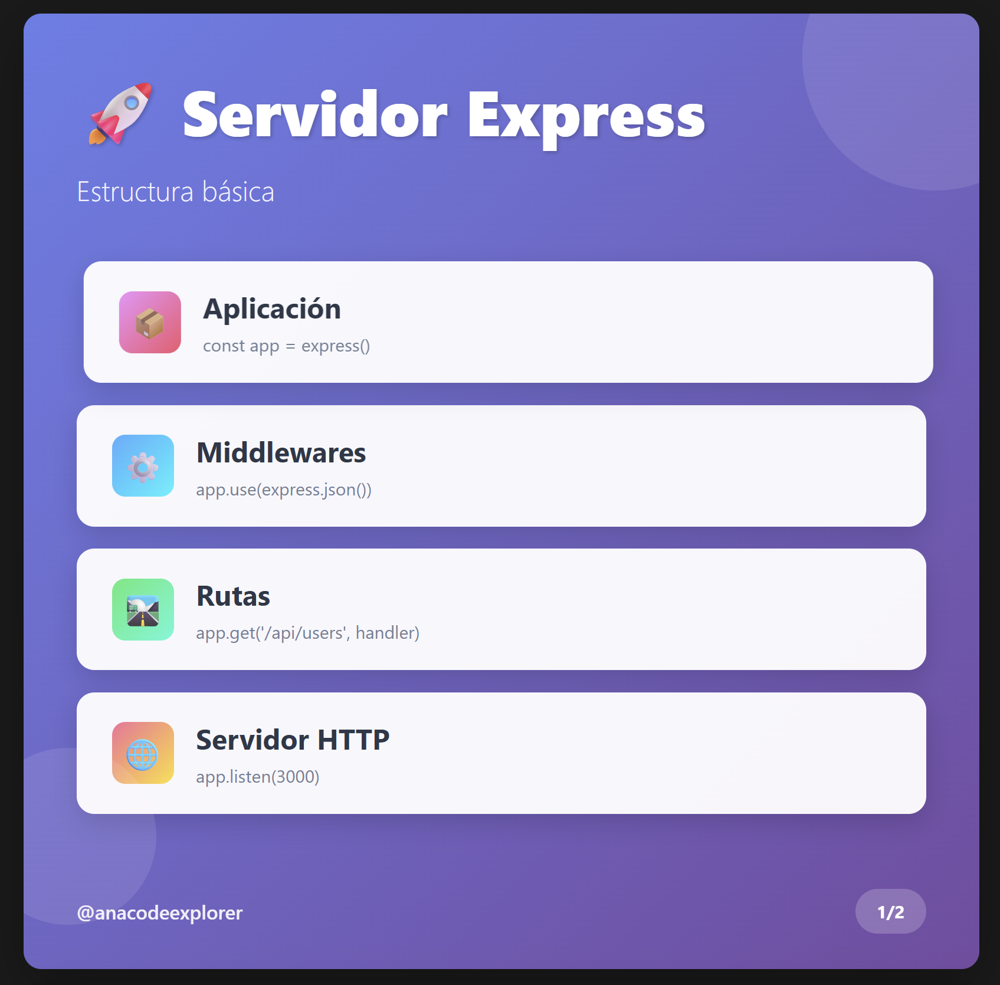

Para iniciar el proyecto, en lugar de hacer "npm init -y" (que crea un package.json con valores por defecto), inicializo el proyecto con "npm init" para poder personalizar los valores del package.json, como el nombre del proyecto, la versión, la descripción, el punto de entrada, el repositorio git, las palabras clave, el autor y la licencia. Esto me permite tener un control más detallado sobre la configuración inicial del proyecto desde el principio.

En el package.json he cambiado el valor del campo "main" de "index.js" a "server.js" para que el punto de entrada del proyecto sea el archivo server.js en lugar de index.js. Además, he añadido un script "start" que permite iniciar la aplicación con el comando "npm start", ejecutando "node server.js".

He instalado Express para poder crear el servidor y manejar las rutas de la API.
El comando usado ha sido: npm install express

He creado el archivo server.js en la raíz del proyecto para crear el servidor que escucha en el puerto 3000.

## Estructura básica de un servidor Express

